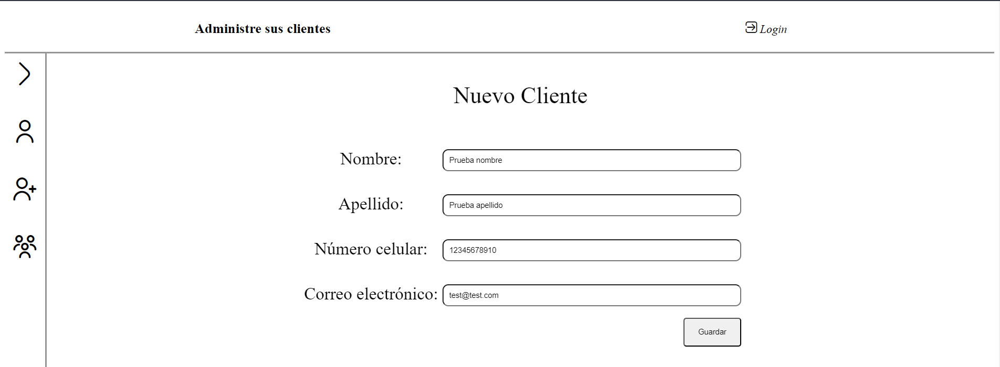
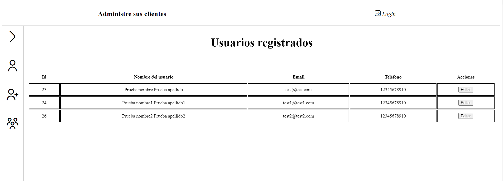
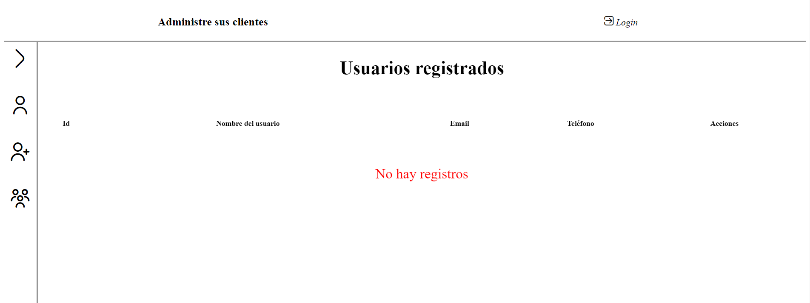

## Backend CRM, basado en Java, utilizando framework Spring con SpringBoot.
# Utilizando DB MySQL
## Se consume desde framework Angular, con interfaz básica, en el frontend se trabaja de forma modularizada, LazyLoad, algúnos operadores de RXJS.

## Formulario para añadir nuevo registro

## Vista donde se muestran los registros añadidos

## Vista donde se lanza una excepción cuando no existen registros
